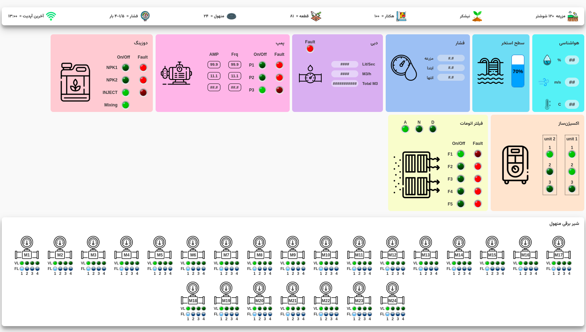

# 🌿 Abyar24

Abyar24 is a simple front-end project built using HTML and CSS, designed as a UI layout for a smart irrigation or agriculture-related service.
In this project, the equipment page for the Abyar 24 site was created (there may be changes in the future) and I had a good collaboration with the company "Sepidyar Hesab Arad".

---

## 🔧 Technologies Used

- HTML5  
- CSS3  
- Responsive Design (optional: Flexbox, CSS Grid, Media Queries)

---

## 📸 Preview



---

## 🚀 Getting Started

To run the project locally:

1. Clone the repository:
   ```bash
   git clone https://github.com/Elnazkhalkhali/abyar24.git

2. Open the project folder in your favorite editor (e.g., VSCode).
3. Open index.html (or your main HTML file) in your browser to see the site.

---

## ⭐ Feature 
- Clean and minimal UI
- Mobile-friendly design
- Useful for practicing front-end layout and styling